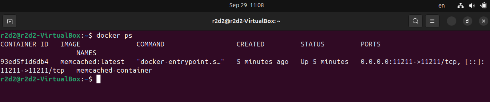
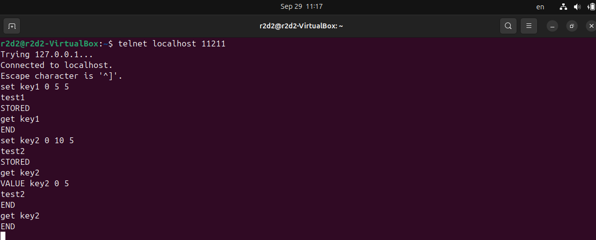
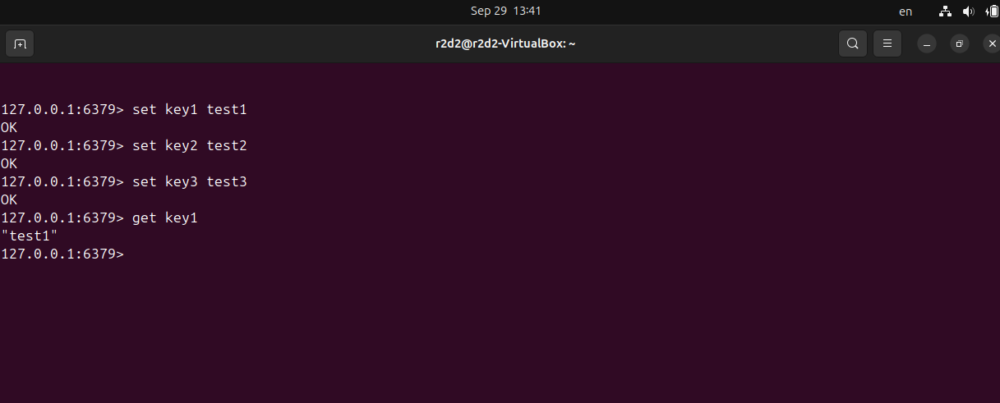
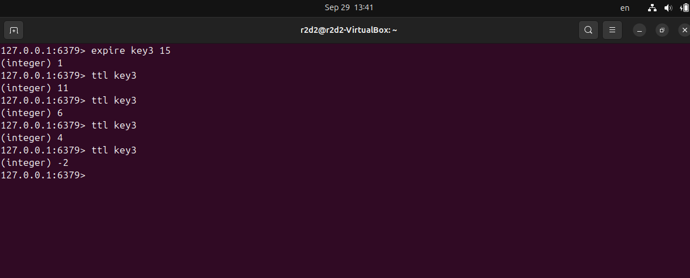
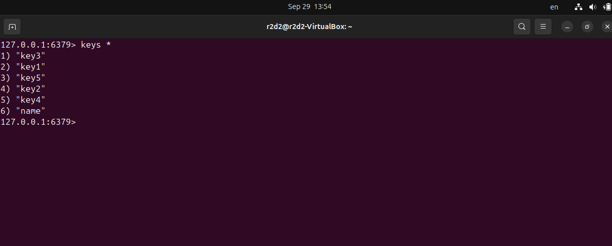
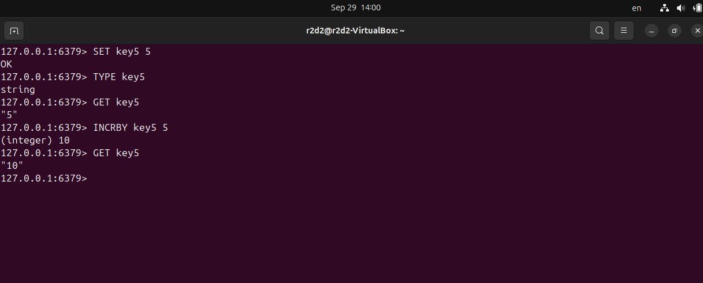

# Домашнее задание к занятию "Кеширование Redis/memcached" - Котов Г.И.

### Задание 1. Кеширование
Приведите примеры проблем, которые может решить кеширование.

Приведите ответ в свободной форме.

### Решение 1:

Кэширование решает три основные группы проблем:
1. **Производительность** — ускорение доступа к данным и отклика системы.
2. **Масштабируемость** — снижение нагрузки на основные ресурсы (БД, CPU).
3. **Доступность** — обеспечение работы системы при сбоях основных источников данных.

---

1. **Проблемы производительности:**
    *   **Медленные запросы к базе данных.** Например, тяжелый SQL-запрос, который выполняется 2 секунды. Решение: сохранить результат в кэш, и последующие запросы будут выполняться за миллисекунды.
    *   **Долгая загрузка веб-страниц.** Решение: кэшировать готовые HTML-страницы, фрагменты верстки или результаты сложных вычислений на стороне сервера.

2. **Проблемы масштабируемости и нагрузки:**
    *   **Высокая нагрузка на базу данных.** Типично для популярных сайтов с большим количеством читающих запросов (например, лента новостей). Решение: кэшировать часто запрашиваемые данные в Redis или Memcached, разгрузив БД.
    *   **Повторные тяжелые вычисления.** Например, расчет рекомендаций для пользователя. Решение: выполнить расчет один раз и сохранить результат в кэш на определенное время.
    *   **Нагрузка на внешние API.** Если ваше приложение зависит от стороннего API с лимитами запросов, кэширование ответов позволит не превышать лимиты и экономит время.

3. **Проблемы доступности и стабильности:**
    *   **«Горячие» данные.** Очень популярный товар или новость, к которым одновременно обращается тысячи пользователей. Без кэша это создаст пиковую нагрузку и может "положить" базу данных. Кэш действует как буфер.
    *   **Частичная недоступность данных.** Если база данных временно недоступна, приложение может некоторое время отдавать устаревшие данные из кэша, сохраняя базовую функциональность.

### Задание 2. Memcached

Установите и запустите memcached.

Приведите скриншот systemctl status memcached, где будет видно, что memcached запущен.

### Решение 2

### Задание 3. Удаление по TTL в Memcached

Запишите в memcached несколько ключей с любыми именами и значениями, для которых выставлен TTL 5.

Приведите скриншот, на котором видно, что спустя 5 секунд ключи удалились из базы.

### Решение 3

### Задание 4. Запись данных в Redis

Запишите в Redis несколько ключей с любыми именами и значениями.

Через redis-cli достаньте все записанные ключи и значения из базы, приведите скриншот этой операции.

### Решение 4

### Задание 5. Работа с числами

Запишите в Redis ключ key5 со значением типа "int" равным числу 5. Увеличьте его на 5, чтобы в итоге в значении лежало число 10.

Приведите скриншот, где будут проделаны все операции и будет видно, что значение key5 стало равно 10.

### Решение 5
